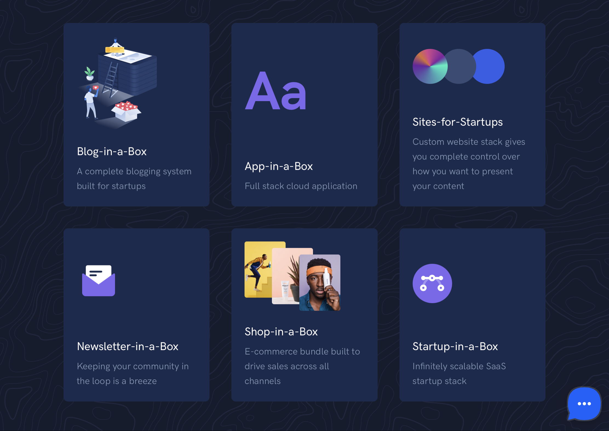

Readability, however, is emphasized above all else. A Markdown-formatted
document should be publishable as-is, as plain text, without looking
like it's been marked up with tags or formatting instructions. 

While Markdown's syntax has been influenced by several existing text-to-HTML filters -- including [Setext](http://docutils.sourceforge.net/mirror/setext.html), [atx](http://www.aaronsw.com/2002/atx/), [Textile](http://textism.com/tools/textile/), [reStructuredText](http://docutils.sourceforge.net/rst.html),
[Grutatext](http://www.triptico.com/software/grutatxt.html), and [EtText](http://ettext.taint.org/doc/) -- the single biggest source of
inspiration for Markdown's syntax is the format of plain text email.

#Blog-in-a-Box Gumroad Code injection testing 

<a class=“gumroad-button” href=“https://gumroad.com/l/zwIVA” target=“_blank”>Buy my product</a>

#Gumroad Embed Script

<a href=“https://gumroad.com/l/zwIVA”>Loading...</a>

This is [Blog-in-a-Box | Buy Now](href=“https://gumroad.com/l/zwIVA) inline link.

###In-line purchase without leaving your site

<a class=“gumroad-button” href=“https://gumroad.com/l/zwIVA” target=“_blank”>Add to stack | Buy Now </a>

<a class=“gumroad-button” href=“https://gumroad.com/l/zwIVA” target=“_blank”>Blog-in-a-Box | Buy Now </a>

###Auto-trigger the payment form

<a class=“gumroad-button” href=“https://gumroad.com/l/zwIVA?wanted=true” target=“_blank”>Blog-in-a-Box | Buy Now </a>

####Allow single-product purchases only

<a class=“gumroad-button” href=“https://gumroad.com/l/zwIVA” target=“_blank” data-gumroad-single-product=“true”>Blog-in-a-Box | Buy Now </a>

#youtube embed in markdown

https://youtu.be/vB6rmWCmANA

###iframe

<iframe src=“https://www.youtube.com/embed/QH2-TGUlwu4” width=“560” height=“315” frameborder=“0”></iframe>

#Images

Images are added with ``

### Images

Images are added with ``

### Images

Images are added with ``

### Images

Images are added with ``

### Blockquotes

Markdown uses email-style `>` characters for blockquoting. If you’re
familiar with quoting passages of text in an email message, then you
know how to create a blockquote in Markdown. It looks best if you hard
wrap the text and put a `>` before every line:

